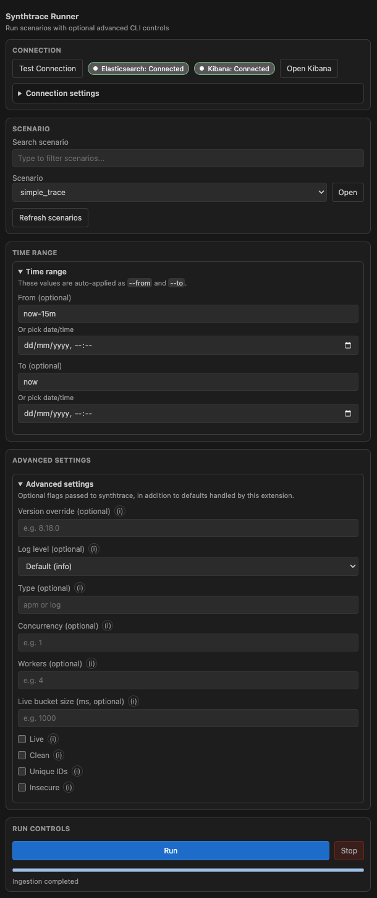

# Synthtrace Runner

`Synthtrace Runner` is a VS Code/Cursor sidebar extension that helps you run Kibana
`synthtrace` scenarios without leaving the IDE.

It provides a UI for connection testing, scenario discovery, advanced CLI options,
run control, and progress visibility.

## Preview

## What The Extension Does

- Tests Elasticsearch and Kibana connectivity from the sidebar.
- Loads runnable synthtrace scenarios directly from your opened Kibana workspace.
- Lets you search scenarios by name and open the selected scenario file in the IDE.
- Builds and runs `scripts/synthtrace.js` with:
  - automatic options (`--target`, `--kibana`, `--apiKey`, `--from`, `--to`)
  - optional advanced settings (`--live`, `--clean`, `--workers`, `--logLevel`, etc.)
- Shows ingestion progress, including live-mode behavior.
- Exposes quick actions such as opening Kibana in the browser.

## Prerequisites

- Node.js 18+ (or a version compatible with your VS Code/Cursor setup)
- Kibana repository dependencies bootstrapped (for synthtrace usage)
- A workspace that includes a Kibana folder containing:
  - `scripts/synthtrace.js`
  - `src/platform/packages/shared/kbn-synthtrace/src/scenarios`

## Workspace Detection

The extension scans all opened workspace folders and automatically picks the one
that contains both required Kibana paths above.

If neither path is found in any folder, scenarios will not load and run/open
actions will show an error.

## Build And Run (Development)

1. Install dependencies:
   - `npm install`
2. Compile:
   - `npm run compile`
3. Start extension dev host:
   - Press `F5` in VS Code/Cursor (Run Extension)
4. In the Extension Development Host window, open the **Synthtrace Runner** activity bar view.

### Optional: watch mode

- `npm run watch`

## Add It To Your IDE

### Option 1: Run locally (best for development)

- Use `F5` to launch an Extension Development Host.

### Option 2: Package as VSIX and install

1. Package:
   - `npm run package`
3. Install in VS Code/Cursor:
   - VS Code: `Extensions: Install from VSIX...`
   - Cursor: same extension install flow from VSIX

## Main UI Sections

- **Connection**
  - Test connection
  - View Elasticsearch/Kibana status badges (including checking state)
  - Open Kibana URL from connection settings
- **Scenario**
  - Search/filter scenarios
  - Select scenario
  - Open selected scenario in IDE
  - Refresh scenario list
- **Time Range**
  - Configure `from`/`to` (auto-applied CLI options)
- **Advanced Settings**
  - Optional synthtrace flags with inline help
  - Modified-settings badge with live counter
- **Run Controls**
  - Run/stop execution and monitor ingestion progress

## Notes

- Output logs are written to the **Synthtrace Runner** output channel.
- This extension is designed to work in both VS Code and Cursor.
- Default connection values:
  - Elasticsearch: `http://localhost:9200`
  - Kibana: `http://localhost:5601`
  - Username: `elastic`
  - Password: `changeme`
